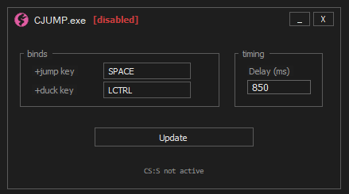

# CJUMP

CJUMP.exe is a small utility that automates crouch-jumping in Counter-Strike: Source.  
You hold your jump key, and the program handles pressing and releasing duck for you with a consistent delay. It only activates when CS:S is focused and it backs off while you're typing or tabbed out.

This is for players who want to crouch-jump while still holding space (or any custom jump key) without having to bind crouch to the jump key.

## Features

- Hold jump to perform a crouch-jump  
- Automatic duck release with a configurable delay  
- Custom key binds (supports keyboard + mouse buttons)  
- Typing suppression so it never messes with chat or console  
- Auto-pauses when CS:S isn't the active window  
- Saves config next to the executable (`cjump.cfg`)  

## VAC Safety

CJUMP.exe never injects into the game, never reads or writes game memory, and never hooks the CS:S process in any way.  
It only listens for global key presses and sends OS-level keyboard events back through Windows.

No injection, no signatures, no engine interaction.  
Because it behaves like a normal keyboard macro at the OS layer, it is **VAC safe**.

## Requirements

- [.NET 9.0 Runtime](https://dotnet.microsoft.com/en-us/download/dotnet/9.0)

## Usage

1. Launch CJUMP.exe  
2. Set your jump key, duck key, and preferred delay  
3. Press **Update** to save  
4. Open CS:S — the tool enables automatically when the game is focused  
5. Hold your jump key and CJUMP handles the crouch timing  

**Important:** Your in-game jump key (usually SPACE) must be bound to `+jump`.  
You can confirm with:
bind space +jump

## Preview

